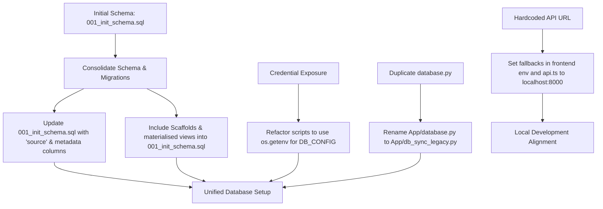

# Acquisition System — Codebase Diagnostic & Database Audit Report

This report presents the findings of a comprehensive audit of the **Acquisition System (Module 2)** codebase located at `D:\PolyNovea\PolyNovea\Docx\Company Docx\Acquistion System`. The audit scanned the data pipeline (`Database/` folder), the web application backend (`App/backend/`), and the Next.js frontend (`App/frontend/`) for bugs, schema mismatches, dead code, security issues, and deployment discrepancies.

---

## Executive Summary of Findings

| Finding Category | Severity | Description | Impact |
| :--- | :--- | :--- | :--- |
| **Schema Mismatch** | 🔴 Critical | The initial database schema creates tables without the `source` column, but active API routers and pipeline scripts query/write utilizing `source` filters and constraints. | Out-of-the-box runtime crashes during data load and API endpoint execution. |
| **Forgotten Migrations** | 🟡 Medium | Schema migration scripts in `Database/scripts/schema/` exist but are not referenced in the setup guide or run in the pipeline runner. | The database remains in an un-migrated state when strictly following the setup guide. |
| **Duplicate Database Modules** | 🟡 Medium | Identical filename `database.py` exists in `App/` (synchronous `psycopg2`) and `App/backend/` (asynchronous `asyncpg`). | Potential import collisions; FastAPI lifespans might attempt to await synchronous pool initialization, causing immediate server failure. |
| **Security Risks** | 🔴 Critical | Hardcoded PostgreSQL database passwords (`'REDACTED_DB_PASSWORD'`) and hosts are hardcoded inside multiple pipeline and utility scripts. | Exposure of database credentials in git history; failure to follow environment configuration best practices. |
| **Documentation Gaps** | 🟢 Low | Setup paths in `RDS_SETUP.md` contain file resolution errors (e.g. `scripts/run_pipeline.py` instead of `scripts/utils/run_pipeline.py`). | Developer confusion/failure when attempting to run command-line tools. |
| **Hardcoded Frontend API URL** | 🟡 Medium | Local Next.js config and api client fallback point to a hardcoded remote IP address (`http://43.205.229.130:8000`). | Local frontend dev servers query the remote staging environment instead of the local FastAPI backend. |

---

## Detailed Findings & Diagnostic Analysis

### 1. Table Schema vs. Code Queries Mismatch (🔴 Critical)
The base database schema defined in [001_init_schema.sql](file:///D:/PolyNovea/PolyNovea/Docx/Company%20Docx/Acquistion%20System/Database/sql/001_init_schema.sql) does not align with the queries executed in the application backend or the pipeline scripts.

> [!WARNING]
> **Key Symptoms:**
> - `venue_fitness_dimensions` is created with a `UNIQUE(venue_id)` constraint and **no `source` column**.
> - Similarly, `behavioral_summary`, `intervention_triggers`, `venue_vectors`, and `venue_similarity` tables lack `source` columns and only restrict uniqueness based on `venue_id`.
> - However, backend router endpoints (such as [overview.py](file:///D:/PolyNovea/PolyNovea/Docx/Company%20Docx/Acquistion%20System/App/backend/routers/overview.py#L57), [competitors.py](file:///D:/PolyNovea/PolyNovea/Docx/Company%20Docx/Acquistion%20System/App/backend/routers/competitors.py#L149), [transform.py](file:///D:/PolyNovea/PolyNovea/Docx/Company%20Docx/Acquistion%20System/App/backend/routers/transform.py#L213), [marketing.py](file:///D:/PolyNovea/PolyNovea/Docx/Company%20Docx/Acquistion%20System/App/backend/routers/marketing.py#L307), [intelligence.py](file:///D:/PolyNovea/PolyNovea/Docx/Company%20Docx/Acquistion%20System/App/backend/routers/intelligence.py#L195), [risk.py](file:///D:/PolyNovea/PolyNovea/Docx/Company%20Docx/Acquistion%20System/App/backend/routers/risk.py#L95), and [venues.py](file:///D:/PolyNovea/PolyNovea/Docx/Company%20Docx/Acquistion%20System/App/backend/routers/venues.py#L40-L45)) filter using `WHERE source = 'blended'`.
> - Data loaders (like [step5_fitness_scores.py](file:///D:/PolyNovea/PolyNovea/Docx/Company%20Docx/Acquistion%20System/Database/scripts/pipeline/google_places_api/step5_fitness_scores.py#L39-L44) and [step6_fitness_and_interventions.py](file:///D:/PolyNovea/PolyNovea/Docx/Company%20Docx/Acquistion%20System/Database/scripts/pipeline/magicpin_upper/step6_fitness_and_interventions.py#L35-L43)) perform SQL inserts utilizing the `source` column and specifying `ON CONFLICT (venue_id, source)` constraint handlers.

**Resulting Error:** If the database is initialized with `001_init_schema.sql` and the pipeline or backend is run directly, it will fail immediately with:
`psycopg2.errors.UndefinedColumn: column "source" of relation "venue_fitness_dimensions" does not exist`

---

### 2. Disconnected & Forgotten Schema Migrations (🟡 Medium)
The repository contains several migration scripts in [Database/scripts/schema/](file:///D:/PolyNovea/PolyNovea/Docx/Company%20Docx/Acquistion%20System/Database/scripts/schema/) that are designed to bridge these schema gaps:
- [add_source_columns.py](file:///D:/PolyNovea/PolyNovea/Docx/Company%20Docx/Acquistion%20System/Database/scripts/schema/add_source_columns.py): Alters tables to add `source` column and adjusts uniqueness constraints from `(venue_id)` to `(venue_id, source)`.
- [add_source_to_pattern_scores.py](file:///D:/PolyNovea/PolyNovea/Docx/Company%20Docx/Acquistion%20System/Database/scripts/schema/add_source_to_pattern_scores.py): Adds `source` column to `pattern_scores` table.
- [provenance_schema.py](file:///D:/PolyNovea/PolyNovea/Docx/Company%20Docx/Acquistion%20System/Database/scripts/schema/provenance_schema.py): Creates `venue_platform_ids` and `raw_venue_data` tables and adds provenance tracking columns (`computed_at`, `pipeline_version`, `schema_version`).
- [optional_scaffolds.py](file:///D:/PolyNovea/PolyNovea/Docx/Company%20Docx/Acquistion%20System/Database/scripts/schema/optional_scaffolds.py): Creates opt-in tables (`venue_platform_data`, `venue_pos_summary`, `platform_performance_benchmarks`).
- [venue_vectors_vector_confidence.sql](file:///D:/PolyNovea/PolyNovea/Docx/Company%20Docx/Acquistion%20System/Database/scripts/schema/venue_vectors_vector_confidence.sql): Adds `vector_confidence` to `venue_vectors`.
- [venue_subdimension_scores.sql](file:///D:/PolyNovea/PolyNovea/Docx/Company%20Docx/Acquistion%20System/Database/scripts/schema/venue_subdimension_scores.sql): Creates `venue_subdimension_scores` for Google Raw Scrapper reviews.
- [pattern_agreement_view.sql](file:///D:/PolyNovea/PolyNovea/Docx/Company%20Docx/Acquistion%20System/Database/scripts/schema/pattern_agreement_view.sql): Creates `pattern_agreement` materialized view.
- [council_sessions.sql](file:///D:/PolyNovea/PolyNovea/Docx/Company%20Docx/Acquistion%20System/Database/scripts/schema/council_sessions.sql): Creates `venue_council_sessions` table.

> [!IMPORTANT]
> **Issue:** None of these schema updates are included in the base setup SQL (`001_init_schema.sql`), documented in the RDS Setup guide (`RDS_SETUP.md`), or run dynamically by the pipeline orchestrator (`run_pipeline.py`).
> Consequently, setup is fragile and prone to failure because migration scripts must be manually executed in an undocumented order.

---

### 3. Duplicate Database Modules (🟡 Medium)
There are two different database wrapper modules in the repository:
1. **[`App/database.py`](file:///D:/PolyNovea/PolyNovea/Docx/Company%20Docx/Acquistion%20System/App/database.py)**: Initializes a synchronous `psycopg2.pool.ThreadedConnectionPool`.
2. **[`App/backend/database.py`](file:///D:/PolyNovea/PolyNovea/Docx/Company%20Docx/Acquistion%20System/App/backend/database.py)**: Initializes an asynchronous `asyncpg` connection pool.

> [!WARNING]
> **Risk of Name Collision:**
> FastAPI's entry point [`App/backend/main.py`](file:///D:/PolyNovea/PolyNovea/Docx/Company%20Docx/Acquistion%20System/App/backend/main.py#L29) imports `database` modules. Depending on the current working directory or `PYTHONPATH` context from which the FastAPI server is started, it may import the synchronous parent [`App/database.py`](file:///D:/PolyNovea/PolyNovea/Docx/Company%20Docx/Acquistion%20System/App/database.py) instead of the async backend wrapper.
> If it imports the sync version, the app will crash at startup with `TypeError: object NoneType can't be used in 'await' expression` or `AttributeError` because synchronous `init_pool` cannot be awaited.

---

### 4. Hardcoded Database Password (🔴 Critical - Security Risk)
The codebase violates credential management policies by hardcoding PostgreSQL database credentials.

> [!CAUTION]
> **Locations of Hardcoded Credentials:**
> - [add_source_to_pattern_scores.py:L22](file:///D:/PolyNovea/PolyNovea/Docx/Company%20Docx/Acquistion%20System/Database/scripts/schema/add_source_to_pattern_scores.py#L22): Hardcoded password `'REDACTED_DB_PASSWORD'` and database host configuration.
> - [blend_fitness.py:L46](file:///D:/PolyNovea/PolyNovea/Docx/Company%20Docx/Acquistion%20System/Database/scripts/blend/blend_fitness.py#L46): Hardcoded password `'REDACTED_DB_PASSWORD'` and database host configuration.
> - [seed_effbel.py:L12](file:///D:/PolyNovea/PolyNovea/Docx/Company%20Docx/Acquistion%20System/scripts/seed_effbel.py#L12): Hardcoded password `'REDACTED_DB_PASSWORD'` and database host configuration.
>
> *Note: In accordance with user guidelines, these credentials will not be modified or cleared by the system automatically during this session, but are flagged here as critical security risks for the developer's attention.*

---

### 5. Setup Guide Path Errors (🟢 Low)
In [RDS_SETUP.md:L123](file:///D:/PolyNovea/PolyNovea/Docx/Company%20Docx/Acquistion%20System/Database/RDS_SETUP.md#L123), developers are instructed to run the pipeline using:
```bash
python scripts/run_pipeline.py
```
**Issue:** `run_pipeline.py` resides under the `Database/scripts/utils/` directory, not `Database/scripts/`. Running the documented command will fail with a file-not-found error. The correct command is:
```bash
python scripts/utils/run_pipeline.py
```

---

### 6. Hardcoded Frontend API Endpoint (🟡 Medium)
The Next.js frontend has a hardcoded endpoint configuration:
- In [App/frontend/.env.local](file:///D:/PolyNovea/PolyNovea/Docx/Company%20Docx/Acquistion%20System/App/frontend/.env.local#L1): `NEXT_PUBLIC_API_URL` is set to `http://43.205.229.130:8000`.
- In [App/frontend/lib/api.ts:L11](file:///D:/PolyNovea/PolyNovea/Docx/Company%20Docx/Acquistion%20System/App/frontend/lib/api.ts#L11): `API_BASE` falls back to `http://43.205.229.130:8000` on the server-side.

**Issue:** If a developer runs the frontend locally using `npm run dev`, it defaults to calling the remote staging IP address instead of their local FastAPI backend server (`http://localhost:8000`), leading to data mismatches and desynchronization.

---

## Proposed Remediation Strategy

To resolve these issues systematically, the following actions are recommended for the next phase of work:



### Plan Details:
1. **Consolidate Base Schema:**
   - Update `001_init_schema.sql` to include the `source` columns, the revised uniqueness constraints, the platform data scaffolds, the materialized view definitions, and the `vector_confidence` column additions.
   - This will allow a single run of `001_init_schema.sql` on a fresh database to yield a fully-upgraded schema.
2. **Remove Hardcoded Secrets:**
   - Refactor `add_source_to_pattern_scores.py`, `blend_fitness.py`, and `seed_effbel.py` to extract connection settings using environment variables (e.g., `os.getenv('PG_PASSWORD')`) with appropriate fallbacks matching the rest of the pipeline.
3. **Address Module Duplication:**
   - Rename `App/database.py` to `App/legacy_sync_database.py` (or similar) to prevent import namespace collisions with `App/backend/database.py`.
4. **Align Frontend API Configuration:**
   - Modify `App/frontend/lib/api.ts` to fall back to `http://localhost:8000` rather than the staging IP when `process.env.BACKEND_URL` is undefined, enabling smooth local onboarding.
5. **Update Setup Guide:**
   - Fix the incorrect path instructions inside `RDS_SETUP.md` to reference `scripts/utils/run_pipeline.py`.
